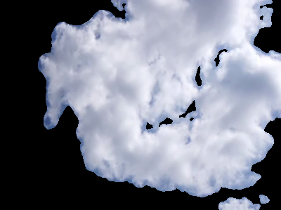

# Cost-Focused Weather Tracking
### (Cloud Categorization & Tracking) 

## TLDR;
Quick yet accurate Weather prediction is imperative for certain industries to now only survive, but simply exist. An important factor of these is the ability to track, categorize and predict movements of clouds within a given area. Current data is not meant for real-time application on a local area level. The  proposal is the construction of a number of 'weather stations' which take atmospheric readings and images of the sky above them to accurately track cloud cover.

The following is a shortened version of the infomation found in my Bachelors thesis on the topic; [""Design and Implementation of a Cost-Effective Sky Imager Station"](https://lnu.diva-portal.org/smash/record.jsf?aq2=%5B%5B%5D%5D&c=295&af=%5B%5D&searchType=LIST_LATEST&sortOrder2=title_sort_asc&query=&language=en&pid=diva2%3A1874520&aq=%5B%5B%5D%5D&sf=all&aqe=%5B%5D&sortOrder=author_sort_asc&onlyFullText=false&noOfRows=50&dswid=7932). The paper is available [online](https://lnu.diva-portal.org/smash/record.jsf?aq2=%5B%5B%5D%5D&c=295&af=%5B%5D&searchType=LIST_LATEST&sortOrder2=title_sort_asc&query=&language=en&pid=diva2%3A1874520&aq=%5B%5B%5D%5D&sf=all&aqe=%5B%5D&sortOrder=author_sort_asc&onlyFullText=false&noOfRows=50&dswid=7932) or [within the repo](/Thesis.pdf)

<br>

# Longer Story
More location-accurate, real-time weather tracking and prediction is an endeavor with wide-reaching application. These include the 
ability to better prepare for local weather conditions,
more refined weather condition description, such as duration and area of effect for storage units and warehouses, and the potential for solar panel owners to more accurately estimate power output using knowledge of cloud-cover.

These sorts of forecasts are usually made using satellite data. This would be from sources such as the MISR Level 2 Cloud product from NASA, showing cloud-motion vectors accurate to 17.6km [2], or the EUMETSAT MTG 3rd Gen. satellite array with a purported resolution of approx. 1km. [10] This data cannot be used for local weather forecasting however, as cloud-cover obscures the view of the land, as well as cloud-heights and environmental readings for overcast areas being unknowable. 

Cloud-height, visibility, humidity are usually measured on the ground via devices such as Ceilometers. This however costs an average of approx. USD $ 30,000 [3] and covers approximately 8 km^2 [12]. Ground-based techniques which utilize a visual component usually do so via the use of calibrated camera arrays performing triangulation (B.Lyu, Y.Chen et al 2021)[13], sometimes going further to separate cloud fields from the sky background to describe cloud cover in terms of both horizontal size and velocity vectors(P.Crispel, G.Roberts 2018)[14]. Techniques which do not make use of a visual component utilize environmental readings such as dewpoint and relative humidity to then calculate the Lifted Condensation Level (LCL). This is “ the height at which an air parcel would saturate if lifted adiabatically ” [9] and can be used as a approximate stand-in for the base-height of a cloud in a given area. This approach may be able to act as a stand-in for areas unable to install a ceilometer, depending on the sensor accuracy [9]. The LCL however, though linearly related to the cloud base-height as shown later, may differ greatly to the actual cloud-base height value, dependent on many factors such as the time of day, time of year and micro-climate of the area. 

<br>

## Proposal
Both a miniaturization and hybridization of existing techniques of cloud feature description must take place. There now exist ceilometer weather stations with reasonable accuracy such as the MWS-M625 from Intellisense which measures at 19 x 14 x 14 cm fitting many high precision instruments, including a 360 deg high-resolution sky-imager [20]. Though inexpensive solutions have been shown such as Dev et al [23] in 2016 in creating whole-sky imagers which cost US$2,500 per unit, as well as Jain et al [5][24] in 2021 and 2022 respectively with costs close to US$300, we believe it possible to drop this further, whilst using less data than either.

The lack of hybridization in related works means that the density of information per image is more sparse than possible if a combination of environmental and visual methods are used.
We propose to: 

- [x] Create weather station(s) able to collect and send weather data within usable sensor accuracy.
    - [x] Set up a weather station at or near the Växjö Kronoberg Airport.

    - [x] Compare the accuracy of the readings against the data of the Växjö Airport.

- [x] Create/host a server which is able to accept multiple connections from these stations and process and store the incoming data.

- [x] Undistort the sky images. This is done by obtaining the intrinsic and extrinsic matrices of the stations prior to their deployment.

- [x] Identify the clouds in the scene via either statistical analysis or simple object detection. 

- [x] Calculate the LCL (Lifted Condensation Level) via the environmental readings given, according to the method outlined in Romps. D (2017).

- [x] Compare the LCL approximated cloud heights against the data of the Växjö Airport.

<br>

## Setup

### ESP32-S3
An ESP32S3 with an OV5640 DVP camera module is pointed at the sky at a location and predetermined angle (preferably perpendicular).

1. An SHT31-D takes Relative Humidity and Temperature readings.
2. A BMP390 takes Air Pressure readings.
3. The Dewpoint is calculated according using the Magnus-Tetens formula [8].
4. An image of the sky is taken with the OV5640.
5. The status of each sensor is sent to the server.
6. The image and readings are sent to the server.
7. The MCU sleeps for pre-determined time.
 


## How

### ESP32-S3

The ESP32-S3-OTG Dev board by Freenove was chosen because of:
1. Better vector instructions for image handling.
2. Insanely better power efficiency.
3. Increased flash memory.
4. OTG capability.

Microcontrollers are programmed using Arduino Studio.
We mostly use VScode for programming. 

* Earlier within the project we used either MicroPython and Python for all components. We languages switched due to speed, memory and compatibility concerns.

The [Flask server](src/Server/server.py) and [analysis tools](src/Server/analysis/) are written in python for ease of use. 

#### Reading from sensors
To read from the SHT31-D, we use the [Adafruit_SHT31](https://github.com/adafruit/Adafruit_SHT31) library. 
To read from the BMP390, we use the [Adafruit_BMP3XX](https://github.com/adafruit/Adafruit_BMP3XX) libray.
We will be connecting these on the same serial bus to the esp, as they occupy different addresses (0x44 and 0x77 respectively). We use pins not occupied by the cameras on internal serial operations (41 and 42). We use the Wire library to make an instance with these as our SDA and SCL for Serial Bus 0.

* Remember to have 3.3kΩ pull-up resistors (at least 2KΩ seems to work fine).

To make things easier, I store pointers to alot of my sensors and networking related objects in structs. I imagine this helps access times as these are stored in continguous memory (With padding based on data type).

<br>

Sensor state object defined in sensors.h:

```cpp
struct Sensors {
    TwoWire *wire;
    Adafruit_BMP3XX BMP;
    Adafruit_SHT31 SHT;
    Adafruit_SSD1306 SCREEN;
    camera_fb_t *CAM;

    struct Status {
        bool CAM = false;
        bool SHT = false;
        bool BMP = false;
        bool WIFI = false;
        bool SCREEN = false;
    } status;
};
```

<br>

Timestamped reading object defined in sensor.h:
```cpp
struct Reading {
    String timestamp = "None";
    String temperature = "None";
    String humidity = "None";
    String pressure = "None";
    String altitude = "None";
    String dewpoint = "None";
};
```

<br>

Network profile object defined in comm.h:

```cpp
struct Network {
    const char* SSID;
    const char* PASS;
    const char* CERT;
    const char* HOST;
    IPAddress GATEWAY;
    IPAddress DNS;
    WiFiClientSecure *CLIENT;
    tm TIMEINFO;
    time_t NOW;

    /**
     * MIME types for the different types of packets.
     */
    struct MIMEType {
        const String IMAGE_JPG = "image/jpeg";
        const String APP_FORM = "application/x-www-form-urlencoded";
    } mimetypes;

    /**
     * Routes on the Server. 
     */
    struct Route {
        const char* IMAGE = "/api/images";
        const char* REGISTER = "/api/register";
        const char* READING = "/api/reading";
        const char* STATUS = "/api/status";
        const char* UPDATE = "/api/update";
        const char* UPGRADE = "/api/upgrade";
        const char* TEST = "/api/test";
    } routes;

    struct Header {
        const String CONTENT_TYPE = "Content-Type";
        const String MAC_ADDRESS = "MAC-Address";
        const String TIMESTAMP = "timestamp"; 
    } headers;
};
```

<br>

We use pointers and have a majority of these functions in separate cpp files to separate responsibility. Sensor related functionality is in [sensors.cpp](src/Server/onboard/sensors.cpp), and networking related functionality is in [comm.cpp](src/Server/onboard/comm.cpp). 
Pointers are also useful so that the structures containing them can be kept within a global scope, and mutated within methods. I find this helps keep memory management simple. 

<br>

### Sending Sensor Data

Statuses, readings and images are sent via different functions in comm.cpp. The layout of each function is the same. The readings and statuses are both sent in the URL of GET requests. Once that's sent, we print the return code and end the connection. Low-level details are taken care of by the HTTPClient library.

```cpp
void sendStats(HTTPClient *https, Network *network, Sensors::Status *stat, const String& timestamp) {
    const String values ="sht="  + String(stat -> SHT) +
                        "&bmp=" + String(stat -> BMP) +
                        "&cam=" + String(stat -> CAM);

    String url;
    url.reserve(strlen(network -> HOST) + strlen(network -> routes.STATUS) + values.length() + 2);
    url.concat(network -> HOST);
    url.concat(network -> routes.STATUS);
    url.concat("?" + values);

    https -> begin(url, network -> CLIENT);

    send(https, network, timestamp);
}
```

Headers are modified within the send() function in comm.cpp. Both readings and statuses are sent this way.

```cpp
void send(HTTPClient *https, Network *network, const String& timestamp) {
    https -> setConnectTimeout(READ_TIMEOUT);
    https -> addHeader(network -> headers.CONTENT_TYPE, network -> mimetypes.APP_FORM);
    https -> addHeader(network -> headers.MAC_ADDRESS, WiFi.macAddress());
    https -> addHeader(network -> headers.TIMESTAMP, timestamp);

    int httpCode = https -> GET();

    getResponse(https, httpCode); 
}
```

This function is overloaded to send the image buffer from the camera as a POST request.
```cpp
void send(Network *network, const String& timestamp, camera_fb_t *fb) {
    ...
    network -> HTTP -> addHeader(network -> headers.CONTENT_TYPE, network -> mimetypes.IMAGE_JPG);
    ...
    int httpCode = network -> HTTP -> POST(fb -> buf, fb -> len);
    ...  
}
```

# Contents

    1.0 ................ Cost Per Unit

    2.0 ................ Sensor Accuracy

    3.0 ................ Cloud-Sky Separation
        3.1 ............ Object Segmentation
        3.2 ............ Channel Distribution Similarity
            3.3.1 ...... 
            3.3.2 ...... Best Curve Determination 

    4.0 ................ LCL (Lifted Condensate Level) Accuracy

<br>

# 1.0. Cost Per Unit

Component | Quantity | Price (sek)
:--------------------------------------:|:-----------------------------------:|:-----------------------------------:|
Freenove ESP32-S3-WROOM CAM w/ 1GB SD Card | 1 | 249 |
Adafruit Sensirion SHT31-D | 1 | 229 |
Adafruit BMP390 | 1 | 179.00 |
OV5640 Camera Module | 1 | 162.76
Domain hosting for 1 year | 1 | 210.03 |
Plastic bags | 50 | 0.36 |
PLA filament (kg) | 1 | 180.00 |
Acrylic piece (6cm) | 1 | 2.00 |
Magnets | 3 | 1.00 | 
M3 60mm screws | 3 | 1.00 |
M8 30mm screws | 3 | 1.00 |
M8 nut | 7 | 1.00 |
1mm circle magnets | 1 | 10.00 |
Lacquer (L) | 0.3 | 100.00 | 
Sand (20kg) | 0.5 | 60.00 |
Wire (m) | 1 | 10.00 |
Solar Panel w/ MPPT charge regulator | 1 | 150.00
16850 Battery | 1 | 30.00 |
Battery Management System | 1 | 13.00 | 
Wire Sheathing (m) | 0.5 | 10.00 |
POWER sockets 10 set pre-soldered
**TOTAL** | **1573.74**

This cost of 1,573.74kr (USD $145,14 as of time of writing) is both lower than the cost-focused sky-imager models mentioned previously, such as [10] which cost US$2,500 per unit, as well as [11], [12] respectively with costs close to US$300. These however, do not make use of centralised servers to further analyse gathered data, and neither of these make use of environmental readings. Comparing then to more similar previously mentioned systems such as [28] at a cost of $650 USD, we are once again much more cost-effective for the density of information gained via the system.


<br>

# 2.0 Sensor Accuracy

To answer the research question of “what is the accuracy of the sensor readings in comparison to reported METAR readings”, we compare the readings from these sensors over the period of April 12th to May 8th, 2024 to the METAR readings from the Växjö airport over the same period.


In above figure we see the surprising accuracy of the sensors across the multiple measures. Actual values differ, this however may be due to a number of factors faced as technical challenges during deployment:

1. As can be seen by the jagged edges in the figures, measures were taken only during the day, and for some days not at all due to maintenance or changes to weather station housing.
2. Constant recalibration of the sensors is needed with changing pressure at sea level. This was not implemented, meaning the sensors were uncalibrated for most of the deployment window. This can be seen especially in the pressure readings.

The general trends in value are followed however, pointing to the ability to use the sensors for this task, however, there are many things to note about these trends:

1. The relative humidity has the largest disparity in any one reading at ~20%, however, retains the smallest average disparity in readings at less than 2%.
2. The largest average disparity in readings is seen in the air pressure readings, with an average of approximately 500 Pa as a seeming constant offset across all readings.

Another note in deployment is that timestamps were not synced up with the METAR reading duty cycle. This means that in many cases, the time delta between readings may be multiple minutes. This makes more complex analysis especially difficult. This is the fault of the author and has since been noted by the Science Park as a requirement in development. Time constraints however, did not allow for integration of this into the research presented. With the difficulties surrounding the gathering of environmental data, we are unable to conclusively (quantitatively) answer the research question posed as to the accuracy of the sensors. Qualitatively, we are able to visually see the accuracy of the sensors with what is given, and take  this quantitative proof as future work.


<br>

# 3.0 Cloud-Sky Separation

Images samples have been taken with a variety of cameras which includes the OV5640. These are compared with multiple shots from various DSLR cameras, taken as frames from timelapses.

Camera Model | <div style="width:800px">Image Sample</div>
:--------------------------------------:|:-----------------------------------:|
OV2640 | 
OV5640 | 
DSLR | 

While colour space based operations are fairly easy on high quality images, the OV2460 is not high quality. Contrast is low, over/under-exposure are almost ensured and ISO changes are not only drastic but cause unwanted light filtering and other strange behaviour.
The OV5640 seems more suited to this application due to it's 5MP shooting capability and higher dynamic range. Contrast, color accuracy, and exposure can be handled dynamically and are stepped up/down smoothly. This seems to also be bared out in our data.

## 3.1. Object Segmentation

To distinguish initially between Sky and Cloud regions, for each reference image, a segmented image is made where "sky" regions are coloured as black, and "cloud" regions are coloured as red.
The boundary between cloud and sky is left bare as to not muddy results.

Reference Image            |  Blocked Image
:-------------------------:|:-------------------------:|
  |  

<br>

This is used to create two binary masks.

<br>

Cloud Mask Bitmap          |  Sky Mask bitmap
:-------------------------:|:-------------------------:|
  |   

<br>

Then subsequent masked images of the reference image, one for the clouds and one for the sky in the scene.

<br>

Cloud Masked Image          |  Sky Masked Image
:-------------------------:|:-------------------------:|
  |  

These are split, iterated over and their colour channel values recorded as a frequency distribution.

The following shows the frequency graphs for the colour channels of the 60 images of the sky, separated into regions of sky and cloud.

Desc. | Histogram
:-----------------------------------:|:------------------------------------:|
RGB Distribution |  
HSv Distribution | 
YCbCr Distribution | 

<br>

Above we see that the Saturation channel, as well as Chroma Read and Blue would be good for discriminating between sky and cloud areas.

<br>

The "usefulness" of channels however, should intuitively depend on factors such as the frequency response of the particular camera model.
This is borne out in our results as you will see below, as camera models differ in the the channels which are quantifiably "useful".

<br>

## 3.2. Channel Distribution Similarity

We use the Jaccard similarity index between two given distributions to determine their overlap. As stated, we observe the distributions of colour channels in the RGB, HSV and YCbCr colour spaces. We build the distributions per colour-channel for a given space and calculate the similarity index between them. As the index is a measure of similarity between 0 to 1.0, distributions which have a similarity of 0.5 or less are considered viable in distinguishing the two groups apart. We then can analyse the top N  channels with scores below 0.5.
The Jaccard index was calculated for our DSLR group on the three (3) colour spaces, as well as the OV5640. The top channels under 0.5 similarity for each is taken. The results are as follows:

<br>

Camera | Jaccard Dictionary
:-----------------------------------:|:------------------------------------:|
DSLR|  
OV5640 | 

 It becomes apparent here both that the same set of channels can be seen as viable across our camera data, and that the order of their similarity is relative to the camera, as expressed before. Both the scores and their rankings within the sorted dictionaries are different. Channels such as Green and YCbCr Brightness are not present in the results for the DSLR whilst appearing for the OV5640 group.


<br>

## 3.3. ROC Curve

To now further refine the choice of colour channels, we construct ROC curves of the possible upper and lower bounds used for masking in a given channel, to quantify its ability to classify the pixels as either "cloud" or "sky". 

<br>

ROC curves illustrate the performance of a binary classifier model at varying threshold values. As such, they are not used in testing two simultaneous variables as is the case with our upper and lower boundaries, but just one [25]. To remedy this, we fix each lower bound at a given value, then test all feasible upper bounds, and visualise this as an independent curve. This means that for each channel, we get multiple curves on the same plot, each showing the performance of simple masking given the fixed lower bound and a number of possible upper bounds. This is done in a number of steps:

The pool of images is randomly divided into a number of strata via bootstrapping, each containing 30 images (arbitrarily chosen). 
The full set of boundary permutations is generated.
Within each strata, each curve is generated and stored.
Across each strata now, the respective curve for each strata is averaged to be used.

In calculating things such as the True Positives, False Positives, etc, for the respective confusion matrices of each boundary, it is important to note that the “True” label of a pixel is taken as the label assigned by a human. The boundary attained in the end then is one which most closely aligns with the human labelling the pixels.
While usually, if a number of ROC curves are averaged, their spread should also be taken into account [26], for our calculation of discrete boundaries, it was determined that for our purposes we may neglect this. 

 An example is this is below - The Saturation Channel in the HSV Colourspace for the DSLR groups:

Camera | Saturation ROC Curve | Chrome Blue ROC Curve
:-----------------------------------:|:------------------------------------:|:------------------------------------:|
DSLR |  |  | 
OV5640 | |  | 


### 3.3.1. Best Curve Determination 
The challenge now lies in determining the optimal lower bound using these curves. The simplest approach is to use the Area Under the Curve (AUC) as outlined in Section 3.3.1. However, as the lower bound increases, the number of corresponding upper bounds decreases, complicating this determination. Smaller lower-bound values might have an "advantage" due to having more data points, resulting in a larger curve. Nonetheless, since most valid masking ranges cover most of the distribution, this issue does not significantly impact the results.
As said, we select the curve with the highest AUC. If a channel does not contain a curve with at least an AUC of 0.5, it is discarded. To then select the maximal point on the graph, this can be done in many ways. The criterion for selecting this point many times comes down to business priorities rather than mathematically. In our case however, we have opted to obtain this by selecting the point which maximises the equation TPR−FPR (True Positive Rate minus False Positive Rate).


<br>

Filtering for the best Channels from the ov5640 and DSLR datasets leaves us with the following:

Camera | Optimal Channel Characteristics
:-----------------------------------:|:------------------------------------:|
DSLR | 
OV5640 | 


Both the Saturation and Chroma Blue channels give fairly accurate results within both groups in identifying cloud cover, with a sharp drop-off in accuracy for the next channel in order. It is for this reason that these are selected as the channels used in determining cloud-cover.
While it would be feasible to layer each of these in a manner consistent with their respective accuracy, for our purposes, we simply use a  bitwise AND operation on the masks created from the two most accurate channels, Saturation and Chroma Blue.
One might assume that the accuracy of compounded image masks would be multiplicative, meaning that combining two (2) masks such as the DSLR group masks within table 6.6.0 with accuracies of 0.96050 and 0.95970 would result in a mask with an accuracy of ~0.92180, however in reality, we achieve an accuracy generally higher than product of its parts. To evaluate this, we create composite masks using the boundary values, combined via a bitwise AND. 
In the case of the DSLR group, the accuracy achieved is 0.95327. Similarly within the OV5640 group, the expected accuracy would be ~0.73110, whereas the observed accuracy is 0.84825.

<br>

In addition to identifying cloud and sky pixels, erosion and dilation of the composite mask are performed to remove noise. This process also removes semi-transparent, wispy areas around denser cloud cover, preventing them from being detected as cloud cover. Combined, these steps achieve real-time cloud separation from a scene with surprising accuracy given the simplicity of the method. This method is intended to identify the contours of cloud forms, as demonstrated in [37]. Visual inspection supports this, as shown in the below figures, where cloud cover detection is illustrated using bounding boxes labelled “cloud.” Red denotes the outer contours of a cloud, while green denotes the inner contours. The “cleaned” image state refers to the image after erosion and dilation

Camera | Contours
:-----------------------------------:|:------------------------------------:|
DSLR | 
OV5640 | 

# 4.0. LCL (Lifted Condensate Level) Accuracy

The Lifted Condensation Level can be used in estimating the cloud-base height when only sufficient environmental readings are available. We estimate this according to the method outlined in [9], using the code made available from that publication within our application stack. To visualise the difference in cloud-base versus LCL measurement, we retroactively fetch METAR data for a Set of Airports, and visualise both a fractional delta and simple 1-to-1 comparison in their results. These are available in the below for the Växjö and Heartsfield-Jackson (Atlanta) airports respectively. We previously compared this fractional delta to the pressure, relative humidity, and temperature, to investigate their relationships, however, the relative humidity alone seemed somewhat directly correlated. Through web-scraping Ogimet, a weather information service providing historical weather conditions [40], we have made available METAR data from 01/01/2010 to 30/12/2023 for both the Växjö and Heartsfield-Jackson (Atlanta) airports. The Växjö airport was investigated due to proximity, and the Hartsfield-Jackson airport was chosen due to its abundance of sensors, flat landscape, and lack of large water-bodies nearby. It was suspected by all involved at the Science Park that large water bodies could affect rates of evaporation depending on the time of year, thereby affecting the actual values of the cloud base directly over the airport.
As seen in the bottom scatterplot in bboth figures, while there is an initial linear relation between the calculated and actual height values, this breaks down at or near the 10,000 ft and 5,000 ft markers in each respectively. Many a\\ssumptions made about the LCL on our part have been displayed in these figures to be factual.
One of these is the breakdown in the relationship between LCL and actual cloud height at higher relative humidity. As seen in the top scatter plot within figure 6.8.0, while from about 30% humidity onwards for the Växjö airport, differences in derived versus actual height are as large as 80%, the absolute number of these large disparities grows seemingly exponentially with relative humidity. It is for these reasons that we conclude derived LCL cannot be substituted with reasonable accuracy for the Cloud Base Height.


<br>

Through web-scraping [Ogimet](http://www.ogimet.com/), we have made available METAR data from 01/01/2010 to 30/12/2023 for both the Vaxjo and Heartsfield-Jackson (Atlanta) airports.
THese are viewable for [Växjö here](Devinci/METAR/data/ESMX/) and [ATL here](Devinci/METAR/data/KATL/)

<br>

Firstly, the vaxjo airport was investigated due to proximity. Below we see the graph for the entirety of the period:

Airport | LCL Graph
:-----------------------------------:|:------------------------------------:|
ESMX | 
KATL | 

# References
[1] F. Rocadenbosch, R. Barragan, S. J. Frasier, J. Waldinger, D. Turner, R. Tanamachi, and D. Dawson II, "Ceilometer-Based Rain-Rate Estimation: A Case-Study Comparison With S-Band Radar and Disdrometer Retrievals in the Context of VORTEX-SE," IEEE Trans. Geosci. Remote Sens., pp. 1-17, 2020. [Online]. Available: 10.1109/TGRS.2020.2984458. Accessed: May 19, 2023.

[2] K. Mueller, M. Garay, C. Moroney, and V. Jovanovic, "MISR 17.6 km Gridded Cloud Motion Vectors: Overview and Assessment," Jet Propulsion Laboratory, 4800 Oak Grove, Pasadena, CA, 2012.

[3] EUMETSAT "Meteosat Third Generation," Jan. 2021. [Online]. Available: https://www-cdn.eumetsat.int/files/2020-04/pdf_mtg_info-pack_v12.pdf. Accessed: May 20.

[4] "CL31 Ceilometer for Cloud Height Detection," 2009. [Online]. Available: https://www.vaisala.com/sites/default/files/documents/CL31-Datasheet-B210415EN.pdf. Accessed: May 20.

[5] B. Lyu, Y. Chen, Y. Guan, T. Gao, and J. Liu, "Estimating Geo‐Referenced Cloud‐Base Height With Whole‐Sky Imagers," Earth Space Sci., Aug. 2021. [Online]. Available: https://www.researchgate.net/publication/353288856_Estimating_Geo-Referenced_Cloud-Base_Height_With_Whole-Sky_Imagers. Accessed: May 20.

[6] P. Crispel and G. Roberts, "All-sky photogrammetry techniques to georeference a cloud field," Atmos. Meas. Tech., Jan. 2018. [Online]. Available: https://www.researchgate.net/publication/322849041_All-sky_photogrammetry_techniques_to_georeference_a_cloud_field. Accessed: May 21.

[7] E. Muñoz, R. Mundaray, and N. Falcon, "A Simplified Analytical Method to Calculate the Lifting Condensation Level from a Skew-T Log-P Chart," Avances en Ciencias e Ingeniería, vol. 7, pp. C124-C129, 2015.

[8] D. Romps, "Exact Expression for the Lifting Condensation Level," J. Atmos. Sci., vol. 74, no. 12, pp. 3891-3900, 2017. [Online]. Available: https://journals.ametsoc.org/view/journals/atsc/74/12/jas-d-17-0102.1.xml. Accessed: Apr. 29, 2024.

[9] C. Long, J. Sabburg, J. Calbó, and D. Pages, "Retrieving Cloud Characteristics from Ground-Based Daytime Color All-Sky Images," J. Atmos. Ocean. Technol., vol. 23, no. 5, pp. 633-650, 2006. [Online]. Available: https://journals.ametsoc.org/view/journals/atot/23/5/jtech1875_1.xml. Accessed: May 22.

[10] S. Dev, F. Savoy, Y. H. Lee, and S. Winkler, "WAHRSIS: A low-cost high-resolution whole sky imager with near-infrared capabilities," Proc. SPIE - Int. Soc. Opt. Eng., May 2014. [Online]. Available: https://arxiv.org/abs/1605.06595. Accessed: May 22.

[11] M. Jain, I. Gollini, M. Bertolotto, G. McArdle, and S. Dev, "An Extremely-Low Cost Ground-Based Whole Sky Imager," in Proc. IGARSS, 2021, pp. 8209-8212. doi: 10.1109/IGARSS47720.2021.9553032. [Online]. Available: https://www.researchgate.net/publication/355273402_An_Extremely-Low_Cost_Ground-Based_Whole_Sky_Imager. Accessed: May 22.

[12] M. Jain, V. S. Sengar, I. Gollini, M. Bertolotto, G. McArdle, and S. Dev, "LAMSkyCam: A Low-cost and Miniature Ground-based Sky Camera," Aug. 2022. [Online]. Available: https://www.researchgate.net/publication/362688144_LAMSkyCam_A_Low-cost_and_Miniature_Ground-based_Sky_Camera. Accessed: May 22.

[13] P. Sharma and S. Prakash, "Real Time Weather Monitoring System Using IoT," ITM Web Conf., vol. 40, p. 01006, Aug. 2021. doi: 10.1051/itmconf/20214001006. [Online]. Available: https://www.researchgate.net/publication/353773459_Real_Time_Weather_Monitoring_System_Using_Iot. Accessed: May 23.

[14] Intellisense Systems, Inc., "MWS-M625," 21041 S. Western Ave, Torrance, CA, 90501.

[15] J. Wolfgang, "Research through DESIGN through research - a problem statement and a conceptual sketch," in *Wonderground - DRS International Conference 2006*, K. Friedman, T. Love, E. Côrte-Real, and C. Rust, Eds., Lisbon, Portugal, Nov. 1-4, 2006. [Online]. Available: https://dl.designresearchsociety.org/drs-conference-papers/drs2006/researchpapers/73.

[16] J. F. Nunamaker, M. Chen, and T. D. M. Purdin, "Systems development in information systems research," in *Proceedings of the Twenty-Third Annual Hawaii International Conference on System Sciences*, vol. 3, 1990, pp. 631-640.

[17] K. Peffers, T. Tuunanen, M. Rothenberger, and S. Chatterjee, "A design science research methodology for information systems research," *Journal of Management Information Systems*, vol. 24, pp. 45-77, 2007. [Online]. Available: https://www.researchgate.net/publication/284503626_A_design_science_research_methodology_for_information_systems_research.

[18] P. Offermann, O. Levina, M. Schönherr, and U. Bub, "Outline of a design science research process," in *Proceedings of the 4th International Conference on Design Science Research in Information Systems and Technology*, 2009. doi: 10.1145/1555619.1555629. [Online]. Available: https://www.researchgate.net/publication/221581320_Outline_of_a_design_science_research_process.

[19] OpenCV Team, "OpenCV," About, 2024. [Online]. Available: https://opencv.org/about

[20] A. Bjelkendal and J. Olsson, "Designing a Platform for Creating 3D Product Configurators: A Design Science Study," Dissertation, pg 14, 2023.

[21] G. Demarcq, "Mastering Semantic Segmentation and Instance Segmentation - 2024," Nov. 22, 2023. [Online]. Available: https://www.ikomia.ai/blog/instance-segmentation-and-semantic-segmentation#how-to-use-semantic-and-instance-segmentation-in-machine-learning-projects.

[22] R. Pulapakura, "Image Segmentation — A Beginner’s Guide, The essentials of Image Segmentation + implementation in TensorFlow," *Medium* Feb. 24, 2024. [Online]. Available: https://medium.com/@raj.pulapakura/image-segmentation-a-beginners-guide-0ede91052db7.

[23] S. Tanya, "What are image masking and its various forms?," *Medium*, Feb. 8, 2023. [Online]. Available: https://medium.com/@content.shantatanya05/what-are-image-masking-and-its-various-forms-682ee1422427.

[24] P. Jaccard, "Etude de la distribution florale dans une portion des Alpes et du Jura," *Bulletin de la Societe Vaudoise des Sciences Naturelles*, vol. 37, pp. 547-579, Jan. 1901. doi: 10.5169/seals-266450. [Online]. Available: https://www.researchgate.net/publication/225035806_Etude_de_la_distribution_florale_dans_une_portion_des_Alpes_et_du_Jura.

[25] T. Fawcett, "Introduction to ROC analysis," *Pattern Recognition Letters*, vol. 27, pp. 861-874, 2006. doi: 10.1016/j.patrec.2005.10.010. [Online]. Available: https://www.researchgate.net/publication/222511520_Introduction_to_ROC_analysis.

[26] S. Pintea and R. Moldovan, "The Receiver-Operating Characteristic (ROC) analysis: Fundamentals and applications in clinical psychology," *Journal of Cognitive and Behavioral Psychotherapies*, vol. 9, pp. 49-66, 2009. [Online]. Available: https://www.researchgate

[27] D. Romps, "Exact Expression for the Lifting Condensation Level," Journal of the Atmospheric Sciences, vol. 74, no. 12, pp. 3891-3900, 2017. [Online]. Available: https://journals.ametsoc.org/view/journals/atsc/74/12/jas-d-17-0102.1.xml. Accessed: Apr. 29, 2024.

[28] D. Kairuz-Cabrera, V. Hernández-Rodríguez, O. Schalm, A. Martínez, P. Laso, and D. Alejo, "Development of a Unified IoT Platform for Assessing Meteorological and Air Quality Data in a Tropical Environment," Sensors, vol. 24, p. 2729, 2024. doi: 10.3390/s24092729. [Online]. Available: https://www.researchgate.net/publication/380103836_Development_of_a_Unified_IoT_Platform_for_Assessing_Meteorological_and_Air_Quality_Data_in_a_Tropical_Environment. Accessed: May 24.

[29] A. Agarwal, R. Rajesh, and N. Arul, "Spatially-Resolved Hyperlocal Weather Prediction and Anomaly Detection Using IoT Sensor Networks and Machine Learning Techniques," pp. 89-93, 2023. doi: 10.1109/MoSICom59118.2023.10458839. [Online]. Available: https://arxiv.org/abs/2310.11001. Accessed: May 24.

[30] Pallets, "Flask, Welcome to Flask - Flask Documentation," 2023. [Online]. Available: https://flask.palletsprojects.com/en/3.0.x/. Accessed: May 24.

[31] Oracle, "MySQL:: MySQL 8.0 Reference Manual," 2024. [Online]. Available: https://dev.mysql.com/doc/refman/8.0/en/. Accessed: May 24.

[32] G. Holzmann, "The Power of 10: Rules for Developing Safety-Critical Code," IEEE Computer, vol. 39, pp. 95-97, 2006. doi: 10.1109/MC.2006.212. [Online]. Available: https://www.researchgate.net/publication/220477862_The_Power_of_10_Rules_for_Developing_Safety-Critical_Code. Accessed: May 25.

[33] Bootstrap. (n.d.). Bootstrap website. [Online]. Available: https://getbootstrap.com/. Accessed: May 25.

[34] California Institute of Technology, "F' Flight Software & Embedded Systems Framework - Code and Style Guidelines," 2020. [Online]. Available: https://nasa.github.io/fprime/UsersGuide/dev/code-style.html. Accessed: May 25.

[35]	Bosch SensorTec, "BMP390 High-performance barometric pressure sensor," Doc.-Number: BST-BMP390-FL000-00 / Version_1.0_012020. [Online]. Available: https://cdn-learn.adafruit.com/assets/assets/000/096/781/original/bst-bmp390-fl000.pdf?1604526926. Accessed: May 25.

[36]	Sensirion, "Datasheet SHT3x-DIS Humidity and Temperature Sensor." [Online]. Available: https://cdn-shop.adafruit.com/product-files/2857/Sensirion_Humidity_SHT3x_Datasheet_digital-767294.pdf. Accessed: May 26.

[37]	W. Richardson, H. Krishnaswami, R. Vega, and M. Cervantes, "A Low Cost, Edge Computing, All-Sky Imager for Cloud Tracking and Intra-Hour Irradiance Forecasting," Sustainability, vol. 9, p. 482, 2017. doi: 10.3390/su9040482. [Online]. Available: https://www.mdpi.com/2071-1050/9/4/482. Accessed: May 26.

[38] M. Souza-Echer, E. Pereira, L. Bins, and M. Andrade, "A Simple Method for the Assessment of the Cloud Cover State in High-Latitude Regions by a Ground-Based Digital Camera," Journal of Atmospheric and Oceanic Technology, vol. 23, no. 3, pp. 437-447, 2006. [Online]. Available: https://journals.ametsoc.org/view/journals/atot/23/3/jtech1833_1.xml. Accessed: May 10

[39] National Weather Service, “Information Reporting”, National Oceanic and Atmospheric Administration. Available: https://www.weather.gov/asos/InformationReporting.html. [Online] Accessed: Jun. 12.

[40] Ogimet, G. Ballester Valor, "Ogimet Home Page," 2005-2024. [Online]. Available: https://www.ogimet.com/home.phtml.en. Accessed: Jun. 12.

[41] New Zealand Government, Aviation Security Service, “How to interpret aviation weather information,” Aviation.govt.nz. Available: https://www.aviation.govt.nz/airspace-and-aerodromes/meteorology/how-to-interpret-aviation-weather-information/  [Online] Accessed: Jun. 13.
 
[42] Department of Commerce, National Oceanic & Atmospheric Administration , “NOAA Satellites Detect Severe Solar Storm,” National Environmental Satellite, Data, and Information Service, Mar. 28, 2024. https://www.nesdis.noaa.gov/news/noaa-satellites-detect-severe-solar-storm [Online] Accessed Jun. 13.
 
[43] L. Ahmad, R. Habib Kanth, S. Parvaze, and S. Sheraz Mahdi, “Measurement of atmospheric pressure,” Experimental Agrometeorology: A Practical Manual, pp. 75–81, Dec. 2017. doi:10.1007/978-3-319-69185-5_11 Available: https://www.researchgate.net/publication/321535663_Measurement_of_Atmospheric_Pressure [Online] Accessed: Jun 13.
[44] Linnaeus University, “Introduction to Applied Internet of Things, summer, full-time, distance learning,” Lnu.se, Dec. 14, 2023. Available: https://lnu.se/en/course/introduction-to-applied-internet-of-things/distance-international-summer/ [Online] Accessed Jun. 13.
 
[45] OpenCV, “OpenCV: Eroding and Dilating,” OpenCV, Jun. 12, 2024. Available: https://docs.opencv.org/3.4/db/df6/tutorial_erosion_dilatation.html [Online] Accessed Jun. 13.
